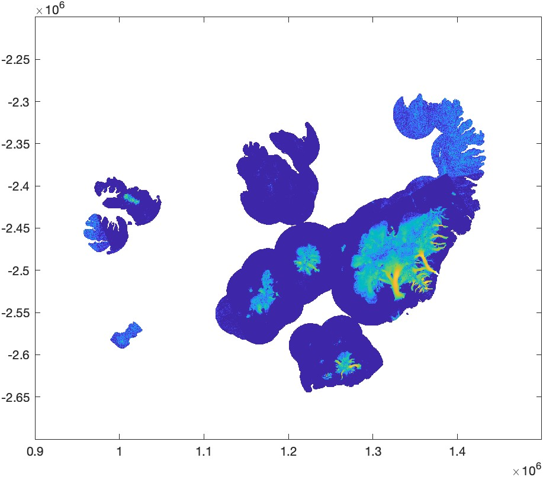
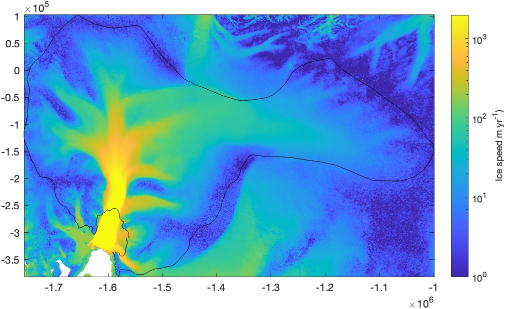
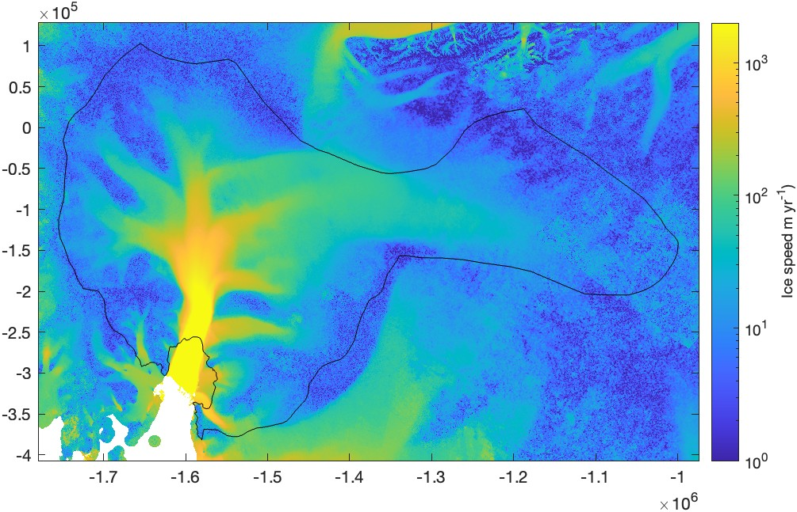
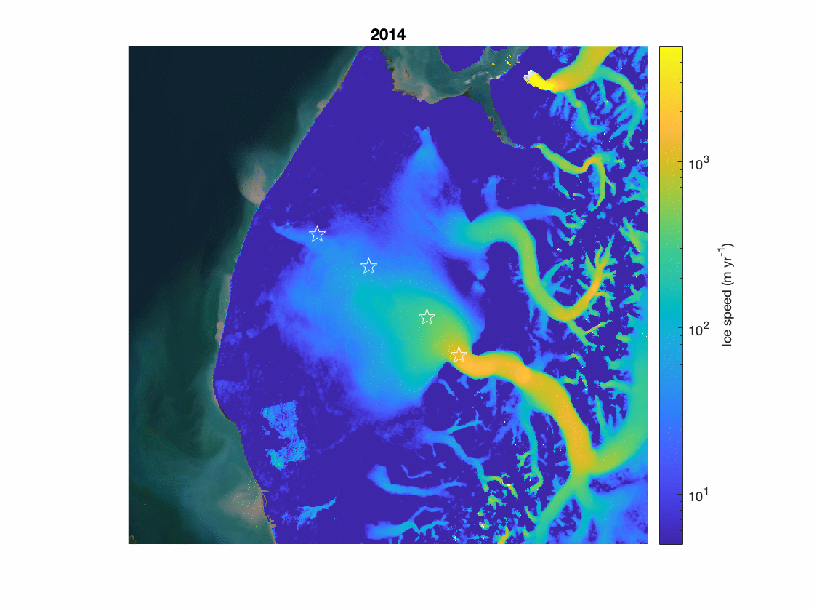

[&larr; Back to ITS\_LIVE main page](../README.md)

# `itslive_data` documentation
The `itslive_data` function reads ITS\_LIVE mosaic data into MATLAB. 

## Syntax

```matlab
Z = itslive_data(region, variable)
Z = itslive_data(..., xlim=xlim, ylim=ylim)
Z = itslive_data(..., latlim=latlim, lonlim=lonlim)
Z = itslive_data(..., buffer=buffer_km)
Z = itslive_data(..., year=years)
Z = itslive_data(..., filepath=path)
[Z,x,y] = itslive_data(...) 
[Z,Lat,Lon] = itslive_data(...,geoout=true)
```

## Description 

`Z = itslive_data(region, variable)` loads any gridded variable in the ITS\_LIVE v2 summary velocity mosaics for a specified region. The region is a number between 1 (Alaska) and 19 (Antarctica). To view a map of the regions, type [`itslive_regions`](itslive_regions_documentation.md). By default, the summary (0000) mosaics are plotted. The input variable can be `"v"`, `"vx"`, `"v_error"`, etc. 
 
`Z = itslive_data(..., xlim=xlim, ylim=ylim)` only loads data within  specified map limits. With this syntax, `xlim` and `ylim` can be two-element arrays indicating the minimum and maximum spatial extents of interest, or you can enter many scattered points and the function will automatically calculate the minimum and maximum values of the x and y limits. 
 
`Z = itslive_data(..., latlim=latlim, lonlim=lonlim)` similar to the `xlim`, `ylim` above, but here geo coordinates are entered (Requires MATLAB's Mapping Toolbox). 
 
`Z = itslive_data(..., buffer=buffer_km)` adds an extra buffer around the limits specified by `xlim`,`ylim` or `latlim`,`lonlim`. The input `buffer_km` can be a scalar value to add a specified buffer on all sides of the input points, or can be a two-element array in the form `[buffer_km_x buffer_km_y]`. 
 
`Z = itslive_data(..., year=years)` specifies desired years for annual mosaics. If years are not specified, only the summary mosaic (0000) is loaded. If multiple years are specified, the output `Z` is a data cube whose third dimension corresponds to each specified year. 

`Z = itslive_data(..., filepath=path)` specifies a directory where the velocity mosaic data reside. 
 
`[Z,x,y] = itslive_data(...)` also returns map coordinates `x,y` when three outputs are requested. 
 
`[Z,Lat,Lon] = itslive_data(...,geoout=true)` returns 2D grids `Lat,Lon` of geographic coordinates corresponding to each pixel in `Z`. (Requires MATLAB's Mapping Toolbox). Note that for large grids such as all of Antarctica at full resolution, the coordinate transformation might take several seconds to compute. 

## Example 1: Iceland
Plot a summary mosaic of Iceland: 

```matlab
[v,x,y] = itslive_data(6, 'v');

figure
h = imagesc(x,y,v); 
h.AlphaData = isfinite(v); % Makes missing data transparent. 
axis xy image              % orients and scales properly 
set(gca,'colorscale','log') 
clim([1 1e3])              % sets color axis limits
exportgraphics(gcf,'itslive_data_documentation_iceland.jpg')
```


## Example 2: Pine Island Glacier, Antarctica
Load all the data in the Pine Island Glacier basin. PIG is in Antarctica, 
so we specify region 19. (This example uses `plotps` from [Antarctic Mapping Tools](https://github.com/chadagreene/Antarctic-Mapping-Tools) and `basin_data` from [Antarctic boundaries](https://github.com/chadagreene/Antarctic-boundaries).) 

```
[lat,lon] = basin_data('imbie refined','pine island'); 
[v,x,y] = itslive_data(19, 'v', latlim=lat, lonlim=lon); 

figure 
h = imagesc(x,y,v); 
h.AlphaData = isfinite(v);   
axis xy image
hold on
plotps(lat,lon,'k')         % AMT function 
set(gca,'colorscale','log') 
clim([1 2e3])              
cb = colorbar; 
ylabel(cb,'Ice speed m yr^{-1})') 
exportgraphics(gcf,'itslive_data_documentation_pig.jpg')
```

 
## Example 3: More Pine Island Glacier, Antarctica
Same as above, but this time add a 25 km buffer on all sides and only load data for the year 2019: 
 
```matlab
[lat,lon] = basin_data('imbie refined','pine island'); 
[v,x,y] = itslive_data(19, 'v', latlim=lat, lonlim=lon, buffer=25, year=2019); 
 
figure 
h = imagesc(x,y,v); 
h.AlphaData = isfinite(v);  
axis xy image 
hold on
plotps(lat,lon,'k')       
clim([1 2e3])   
cb = colorbar; 
ylabel(cb,'Ice speed m yr^{-1})') 
exportgraphics(gcf,'itslive_data_documentation_big_pig.jpg')
``` 


## Example 4: Time Series at Malaspina Glacier

Consider four points along Malaspina Glacier, Alaska, which are used as an example in the [ITS\_LIVE widget](https://its-live.jpl.nasa.gov/app/index.html?lat=60.08343&lon=-140.46707&lat=60.02582&lon=-140.57831&lat=59.92546&lon=-140.72388&lat=59.83722&lon=-140.80765&z=9&x=1982-12-08&x=2025-04-25&y=-404&y=5915).

Use the `itslive_data` function to load data for Region 1 (Alaska) surrounding the four points of interest. Add a 35 km buffer around the four points to provide a little extra context. And load the data for all the years from 2014 through 2022.

*Below I'm using the `geo2itslive` function to transform geo coordinates to projected meters for Region 1. The `geo2itslive` requires MATLAB's Mapping Toolbox. If you don't have that, you can transform the coordinates for Region 1 into EPSG 3413 using the `ll2psn` function in [Arctic Mapping Tools](https://github.com/chadagreene/arctic-mapping-tools).*

```matlab
% Define locations and years of interest: 
lati = [60.08343 60.02582 59.92546 59.83722]; 
loni = [-140.46707 -140.57831 -140.72388 -140.80765]; 
years = 2014:2022; 

% Transform from geo coordinates to Region 1 projected map coordinates:
[xi, yi] = geo2itslive(1, lati, loni); 

% Load velocity data: 
[v, x, y] = itslive_data(1,'v',...
                         latlim=lati,...
                         lonlim=loni,...
                         buffer=35, ...
                         year=years); 
```

Now plot the first time slice of the velocity data cube, which corresponds to the first year in our array, 2014. Below, I'm plotting an optional basemap underneath everything, and you can get that function from my [`plot_basemap`](https://github.com/chadagreene/plot_basemap) repository. 

```matlab
figure
h = imagesc(x,y,v(:,:,1)); 
h.AlphaData = isfinite(v(:,:,1)); % makes NaNs transparent
axis xy image                     % orients and scales the axes properly 
axis off                          % removes labels 
hold on
plot(xi,yi,'wp','markersize',12)  % plots four points as white pentagrams
set(gca,'colorscale','log') 
cb = colorbar; 
ylabel(cb,'Ice speed (m yr^{-1})')
clim([5 5e3])                     % sets color axis limits 
title(num2str(years(1)),'fontweight','bold')

bm = plot_basemap('epsg',3413);   % optional basemap 
exportgraphics(gcf,'itslive_data_documentation_malaspina.jpg')
```


Creating the animation below requires my [`gif`](https://www.mathworks.com/matlabcentral/fileexchange/63239-gif) function. The first call to `gif` initializes the file and the subsequent calls each add a frame. 

```matlab
gif('itslive_data_demo.gif','DelayTime',1/4)

% Update the plot for the remaining years: 
for k = 2:length(years)
    h.CData = v(:,:,k); 
    h.AlphaData = isfinite(v(:,:,k)); 
    title(num2str(years(k)),'fontweight','bold')
    gif                           % adds a gif frame 
end
```



# Author Info
The MATLAB functions in this repo and this documentation were written by Chad A. Greene of NASA/JPL. [The NASA MEaSUREs ITS\_LIVE project](https://its-live.jpl.nasa.gov/) is by Alex S. Gardner and the ITS\_LIVE team. 

