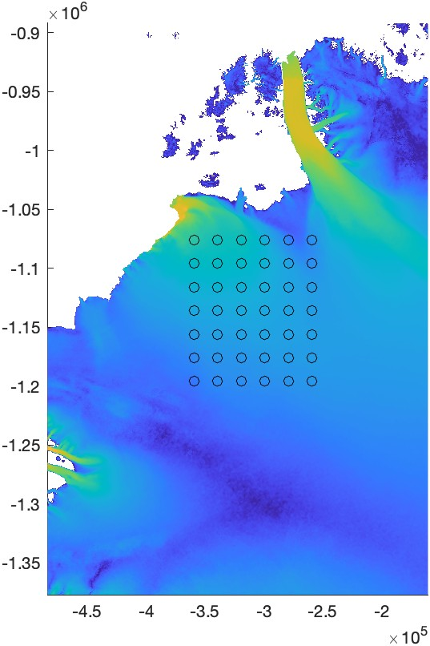

[&larr; Back to ITS\_LIVE main page](../README.md)

# `itslive_flowline` documentation
The `itslive_flowline ` function calculates ice flowlines using ITS\_LIVE mosaic velocity data.

*Note: This function may take a few seconds to run.*

## Syntax

```matlab
[x,y] = itslive_flowline(region,xi,yi)
[lat,lon] = itslive_flowline(region,lati,loni)
[...] = itslive_flowline(...,spacing)
[...,...,d,v] = itslive_flowline(...)
```

## Description 

`[x,y] = itslive_flowline(region,xi,yi)` calculates flow path(s) from seed locations given in projected map coordinates `xi`,`yi`. If multiple starting points are specified, output `xi` and `yi` will be cell arrays. Input region is a number from 1 to 19 corresponding to the mosaic region. For a map of ITS_LIVE regions, type [`itslive_regions`](itslive_regions_documentation.md). Flowlines are calculated upstream and downstream of seed location(s). 

`[lat,lon] = itslive_flowline(region,lati,loni)` as above, but if inputs are geographic coordinates, outputs are too. 

`[...,...,d,v] = itslive_flowline(...)` also returns distance `d` in meters along the flowline. Negative numbers are upstream of the seed location and positive numbers are downstream. If four outputs are requested, the velocity `v` (m/yr) is the linearly interpolated velocity along the flowline(s). 

`[...] = itslive_flowline(...,spacing)` specifies spacing along the flowline in meters. Default spacing is `10` m. 

## Example 1: A single flowline in British Columbia
Consider the location (51.5313°N,125.9555°W) in British Columbia, Canada, which is in RGI & ITS\_LIVE Region 2. Using the [`geo2itslive`](geo2itslive_documentation.md) function, we can convert the coordinates to projected meters in the map coordinates for Region 2: 

```matlab
>> [xi, yi] = geo2itslive(2, 51.5313, -125.9555)
xi =
     295011.70
yi =
    5713051.22
```
The `itslive_flowline` function allows inputs as geo coordinates or projected map coordinates, so since we'll be plotting the results on a map, let's enter the seed location as projected coordinates `xi`,`yi`. Below, we're plotting velocity using [`itslive_imagesc`](itslive_imagesc_documentation.md) for Region 2 after setting the axis limits of the map. We plot the seed location as a yellow pentagram, and for a little extra context we're adding a background image with [`plot_basemap`](https://github.com/chadagreene/plot_basemap) and setting the colormap with [`cmocean`](https://github.com/chadagreene/cmocean):

```matlab
% Define a seed location: 
xi = 295012; 
yi = 5713051; 

figure
axis([260076 329851 5671516 5741291])
itslive_imagesc(2)
hold on
clim([0 200])
plot(xi,yi,'yp','markerfacecolor','y') % yellow pentagram 
plot_basemap('epsg',32610)             % optional basemap 
cmocean amp                            % optional colormap 

exportgraphics(gcf,'itslive_flowline_documentation_BC_1.jpg')
```


From the seed location marked as a yellow star above, get the flowline that passes through that location: 

```matlab
% Calculate flowline from seed location in Region 2: 
[x,y] = itslive_flowline(2,xi,yi); 

% Plot the flowline:
plot(x,y,'y','linewidth',2)

exportgraphics(gcf,'itslive_flowline_documentation_BC_2.jpg')
```


## Example 2: Grid in Greenland 
It is possible to generate multiple flowlines at once. Consider this 7x6 grid of seed locations in northern Greenland, which are plotted on top of an [`itslive_imagesc`](itslive_imagesc_documentation.md) map of velocity for Greenland (Region 5):  

```matlab
% Create a grid of points in projected meters: 
[Xi,Yi] = meshgrid(-359399:20e3:-256068,-1076060:-20e3:-1197793); 

figure
axis([-483846.00 -160640 -1376958 -892150])
itslive_imagesc(5); 
set(gca,'colorscale','log')
hold on
plot(Xi,Yi,'ko')

exportgraphics(gcf,'itslive_flowline_documentation_greenland_grid_1.jpg')

```


With the black circles as seed locations, generate a flowline for each point: 

```matlab
[X,Y] = itslive_flowline(5, Xi, Yi); 

whos 

  Name      Size              Bytes  Class     Attributes

  X         7x6             8331016  cell                
  Xi        7x6                 336  double              
  Y         7x6             8331016  cell                
  Yi        7x6                 336  double              
```
Above, the `whos` call lists variables and their sizes. It tells us that `Xi` and `Yi` are cell arrays whose 7x6 dimensions match the dimensions of `X` and `Y`. Each cell contains an array of the coordinates of the flowlines. Here's an easy way to plot them all in a loop: 

```matlab
for k = 1:numel(X)
    plot(X{k},Y{k},'k')
end

exportgraphics(gcf,'itslive_flowline_documentation_greenland_grid_2.jpg')
```


## Example 3: Pine Island Glacier, Antarctica 
This example uses `mapzoomps` and `scalebarps` from [Antarctic Mapping Tools](https://github.com/chadagreene/Antarctic-Mapping-Tools), `modismoaps` from my [MODIS Mosaic of Antarctica repo](https://github.com/chadagreene/MODIS-MOA), and `bedmachine` and `bedmachine_profile` from my [BedMachine repo](https://github.com/chadagreene/BedMachine). 

I started this example by manually clicking around on a polar stereographic map of the Amundsen Sea Embayment to find a seed location along the grounding line. The seed location is arbitrary, but I selected a spot on the grounding line because it's a helpful reference point for many types of analysis. 

```matlab
x_seed = -1590539; % m easting
y_seed = -256071;  % m northing

figure
mapzoomps('pine island glacier','mapwidth',200) % initialize 200 km wide map
modismoaps('contrast','low')                    % plots background image
hold on
h = itslive_imagesc(19, 'alpha',0.75);          % semitransparent velocity
set(gca,'colorscale','log')
clim([1 3e3])                                   % color axis limits
bedmachine                                      % plots grounding line 
p=plot(x_seed,y_seed,'wo','markersize',8,...    % plots seed location
    'markerfacecolor','r');                     % as white-ringed red dot

exportgraphics(gcf,'itslive_flowline_documentation_pig_map_1.jpg')
```


Now calculate a flowline from the seed location (takes a few seconds on my laptop). Below, I'm plotting the flowline as a red and white line of different linewidths to give the effect of white-outlined red line. 

```matlab
[x,y,d,v] = itslive_flowline(19,x_seed,y_seed);

p(2) = plot(x,y,'w','linewidth',2); 
p(3) = plot(x,y,'r','linewidth',1); 

exportgraphics(gcf,'itslive_flowline_documentation_pig_map_2.jpg')
```


Zoom out to see the entire flowline: 

```matlab
delete(h)                          % deletes old velocity map
axis tight off                     % resets axis limits to all data
modismoaps('contrast','low')       % fills extents with background image    
itslive_imagesc(19, 'alpha',0.75)  % recreates velocity map
bedmachine                         % re-plots grounding line 
uistack(p(2),'top')                % places flowline on top of graphics
uistack(p(3),'top')                % places flowline on top of graphics
uistack(p(1),'top')                % places marker on top of graphics
scalebarps('location','se')        % scalebar in lower right corner

exportgraphics(gcf,'itslive_flowline_documentation_pig_map_3.jpg')
```


And here's what the velocity looks like along the profile: 

```matlab
figure
subplot(2,1,1) 
plot(d/1000,v) 
box off 
axis tight
ylabel("Velocity (m yr^{-1})")

subplot(2,1,2)
bedmachine_profile(x,y,'horiz',d/1000)
axis tight
xlabel("Distance along flowline (km)")
ylabel("Elevation (m)")

exportgraphics(gcf,'itslive_flowline_documentation_pig_profile.jpg')
```


Notice above that the 0 distance along the flowline corresponds to the grounding line, because that's where we defined the seed location. 

# Author & Citation Info
The MATLAB functions in this repo and this documentation were written by Chad A. Greene of NASA/JPL. [The NASA MEaSUREs ITS\_LIVE project](https://its-live.jpl.nasa.gov/) is by Alex S. Gardner and the ITS\_LIVE team. If you use ITS\_LIVE v2 velocity data, please cite: 

Gardner, A. S., Greene, C. A., Kennedy, J. H., Fahnestock, M. A., Liukis, M., López, L. A., Lei, Y., Scambos, T. A., and Dehecq, A.: ITS_LIVE global glacier velocity data in near real time, EGUsphere [preprint], [https://doi.org/10.5194/egusphere-2025-392](https://doi.org/10.5194/egusphere-2025-392), 2025. 