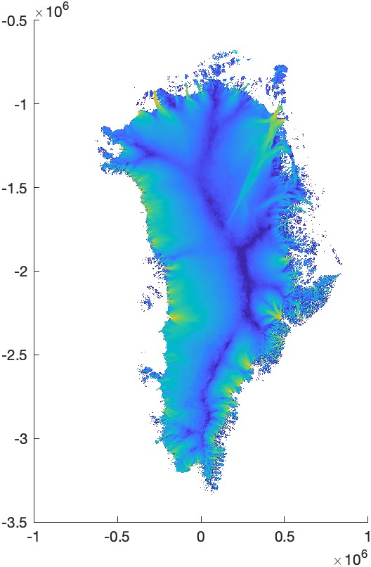
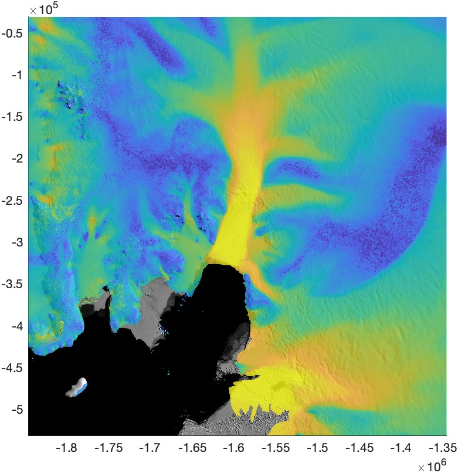

[&larr; Back to ITS\_LIVE main page](../README.md)

# `itslive_imagesc` documentation
The `itslive_imagesc` function plots ITS\_LIVE data in regionally projected map coordinates.

## Syntax

```matlab
itslive_imagesc(region)
itslive_imagesc(region,variable) 
itslive_imagesc(...,'alpha',alpha) 
itslive_imagesc(...,filepath=path)
h = itslive_imagesc(...)
```

## Description 

`itslive_imagesc(region)` plots ITS\_LIVE ice speed as an `imagesc` object for the specified ITS\_LIVE mosaic region. For a map of ITS\_LIVE regions, type [`itslive_regions`](itslive_regions_documentation.md). 

`itslive_imagesc(region,variable)` plots any ITS_LIVE variable such as `'v'`, `'vx'`, `'vy'`, `'vx_error'`, `'landice'`, etc. If a figure is open and axes are current before calling `itslive_imagesc`, only enough data are loaded to fill the extents of the current axes. If no axes are current before calling `itslive_imagesc`, the entire region is loaded and plotted. *Note: Plotting an entire large region such as Antarctica might take several seconds.*

`itslive_imagesc(...,'alpha',alpha)` sets the transparency to a value between 0 (totally transparent) and 1 (totally opaque). Default value is 1, (except for NaNs, which are always set to 0). 

`itslive_imagesc(...,filepath=path)` specifies a directory where the velocity mosaic data reside. 

`h = itslive_imagesc(...)` returns a handle `h` of the image object. 

## Example 1: All of Greenland
Make a map of Greenland's velocity. Greenland corresponds to ITS\_LIVE region 5: 

```matlab
figure
itslive_imagesc(5)
set(gca,'colorscale','log') 
clim([1 10e3])

exportgraphics(gcf,'itslive_imagesc_documentation_greenland.jpg')
```


## Example 2: Pine Island Glacier, Antarctica 
In the example above, we plotted *all* the data for an entire region. But often times, you just want enough data to fill a map of a small region. **To minimize memory requirements and maximize speed, initialize a map and set its extents *before* calling `itslive_imagesc`.**

In the example below, we'll use `mapzoomps` function from [Antarctic Mapping Tools](https://github.com/chadagreene/Antarctic-Mapping-Tools) to set the spatial extents of the map. If you're working on a region other than Antarctica, you can simply use the `axis` command to set axis extents to your liking. Below, we're also using `modismoa` from my [MODIS Mosaic of Antarctica](https://github.com/chadagreene/MODIS-MOA) repo to create a background image. 

Below we're setting the alpha value to 0.8, which makes the ice velocity colors slightly transparent, letting the texture from the MODIS MOA image shine through. 

```matlab
mapzoomps('pine island glacier') 
modismoaps('contrast','low')
itslive_imagesc(19,'v','alpha',0.8) 
set(gca,'colorscale','log') 
clim([1 3000])

exportgraphics(gcf,'itslive_imagesc_documentation_pig.jpg')
```


# Author Info
The MATLAB functions in this repo and this documentation were written by Chad A. Greene of NASA/JPL. [The NASA MEaSUREs ITS\_LIVE project](https://its-live.jpl.nasa.gov/) is by Alex S. Gardner and the ITS\_LIVE team. 

