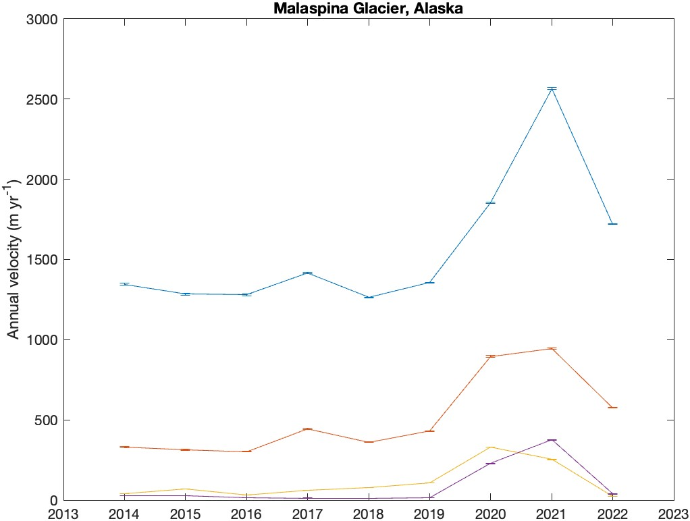

[&larr; Back to ITS_LIVE main page](../README.md)

# `itslive_interp` documentation

## Syntax

```matlab
zi = itslive_interp(region,variable,xi,yi)
zi = itslive_interp(region,variable,lati,loni)
zi = itslive_interp(..., method=InterpMethod)
zi = itslive_interp(..., year=years)
v_along = = itslive_interp(region,'along',...)
v_across = = itslive_interp(region,'across',...)
```

## Description 

`zi = itslive_interp(region,variable,xi,yi)` interpolates ITS_LIVE mosaic data for the specified region and variable, at the projected map coordinates xi, yi. The region is a number from 1 to 19 (type `itslive_regions` for a map). The variable can be `'v'`, `'vx'`, `'v_error'`, or any gridded variable in the ITS_LIVE v2 mosaics. Coordinates `xi,yi` correspond to the map units (m) in the projection of the specified region. 

`zi = itslive_interp(region,variable,lati,loni)` as above, but using geographic coordinates. 

`zi = itslive_interp(..., method=InterpMethod)` specifies an interpolation  method. Interpolation is linear by default, except for variables `'landice'`,  and `'floatingice'`, which are nearest neighbor. 

`zi = itslive_interp(...,'year',years)` specifies years of velocity mosaics. Default year is `0000`, which corresponds to summary mosaics. 

`v_across = itslive_interp(region, 'across',...)` calculates the across-track velocity for a path such as a grounding line `lati,loni` or `xi,yi`. This is designed for calculating the flow across a flux gate. 

`v_along = itslive_interp(region, 'along',...)` the complement to the across track component.  

## Example 1: Time Series at Byrd Glacier, Antarctica 
Plot a time series of annual velocities at a location near the grounding line of Byrd Glacier, Antarctica. The location is 80.38°S, 158.75°E and the region number for Antarctica is 19: 

```matlab 
year = 2014:2022; 
v = itslive_interp(19, 'v',-80.38,158.75,'year',year); 
v_error = itslive_interp(19, 'v_error',-80.38,158.75,'year',year); 

figure
errorbar(year,v,v_error) 
xlim([2013 2023])
ylabel('Annual velocity (m yr^{-1})')
title 'Byrd Glacier, Antarctica'

exportgraphics(gcf,'itslive_interp_documentation_byrd.jpg')
```


## Example 2: Summary velocity values at Malaspina Glacier, Alaska 

In the example above, we plotted a time series of annual velocities at a single location. Now let's plot the summary mosaic values (a multi-year average) for multiple locations at Malaspina Glacier, Alaska (region 1). These are the same locations that are plotted as the [default example in the ITS_LIVE widget](https://its-live.jpl.nasa.gov/app/index.html?lat=60.08343&lon=-140.46707&lat=60.02582&lon=-140.57831&lat=59.92546&lon=-140.72388&lat=59.83722&lon=-140.80765&z=9&x=1982-12-08&x=2025-04-25&y=-404&y=5915). These locations on Malaspina are also used in the [`itslive_data`](itslive_data_documentation.md) documentation to create this map: 

 

```matlab 
% Define locations and years of interest: 
lat = [60.08343 60.02582 59.92546 59.83722]; 
lon = [-140.46707 -140.57831 -140.72388 -140.80765]; 

% Get velocity values: 
v = itslive_interp(1, 'v', lat, lon); 

figure
bar(v)
xlabel 'Data point number'
ylabel 'Summary mosaic velocity (m yr^{-1})'

exportgraphics(gcf,'itslive_interp_documentation_velocity_bar.jpg')
```


How certain can we be about those velocity estimates? Let's take a look at what data went into those values: 

```matlab
v_error = itslive_interp(1, 'v_error', lat, lon); 
count = itslive_interp(1, 'count', lat, lon); 

figure
plot(count, v_error, '.', markersize=50)
xlabel 'Data count'
ylabel 'Velocity error (m yr^{-1})'

exportgraphics(gcf,'itslive_interp_documentation_error_vs_count.jpg')
```


In the figure above, we see that the velocity error estimates are near zero. They're stored as integer values, because there's no use splitting hairs over tenths of meters per year when discussing uncertainties. Although they're stored as integer values, the `itslive_interp` function performs linear interpolation by default, which is why we get one value that isn't exactly an integer. Mostly what we see in the figure above is that uncertainties are low when lots of data are available, and in this case, all four points have at least 2500 velocity measurements, and the uncertainty for the point with over 5500 measurements rounds to zero. 

## Example 3: Time series at multiple locations
To get velocity values for multiple locations and multiple years, just enter them into `itslive_interp` like this: 

```matlab
% Define locations and years of interest: 
lat = [60.08343 60.02582 59.92546 59.83722]; 
lon = [-140.46707 -140.57831 -140.72388 -140.80765]; 
years = 2014:2022; 

% Get annual velocities and error at the specified points:
v = itslive_interp(1, 'v', lat, lon, year=years); 
v_error = itslive_interp(1, 'v_error', lat, lon, year=years); 

figure
errorbar(years,v, v_error)
title 'Malaspina Glacier, Alaska'
xlim([2013 2023])
ylabel('Annual velocity (m yr^{-1})')

exportgraphics(gcf,'itslive_interp_documentation_malaspina_annual.jpg')
```


## Example 4: Grid of points 
This example interpolates ITS_LIVE velocity trend data to a 50 m resolution grid. 

*Note that the native resolution of ITS_LIVE velocity data is 120 m, so interpolating to 50 m meets Nyquist and doesn't require lowpass filtering before interpolation to prevent aliasing. The `itslive_interp` function does not perform any type of antialiasing.*

Below we use just base MATLAB functions until we get to the optional fancy stuff. For those steps you'll need [`cmocean`](https://github.com/chadagreene/cmocean) for the colormap. Also, `modismog` for the background image mosaic of Greenland and `scalebarpsn` for the scalebar, which are both part of [Arctic Mapping Tools](https://www.mathworks.com/matlabcentral/fileexchange/63324-arctic-mapping-tools). 

```matlab
% Create grid: 
res = 50;                   % m grid resolution 
x = -389350:res:-179900; 
y = -813900:-res:-1128100;
[X,Y] = meshgrid(x,y); 

% Get velocity trends at grid points: 
dv_dt = itslive_interp(5, 'dv_dt', X, Y); 
landice = itslive_interp(5, 'landice', X, Y); 

figure
h = imagesc(x,y,dv_dt); 
h.AlphaData = landice;       % make non-ice transparent 
axis xy image off 
clim([-1 1]*10)              % sets color axis limits
cb = colorbar; 
ylabel(cb,'Velocity trend 2014-2022 m yr^{-2}')

% Optional fancy stuff: 
cmocean balance              % sets colormap 
modismog('contrast','white') % modis mosaic of greenland
scalebarpsn('location','se') % part of Arctic Mapping Tools

exportgraphics(gcf,'itslive_interp_documentation_greenland_grid.jpg')
```


## Example 5: Flux gate analysis
This example calculates total flux out of Antarctica's Pine Island Glacier basin. We'll get the basin boundaries using the `basin_data` function, which you can find in the [Antarctic boundaries repo on GitHub](https://github.com/chadagreene/Antarctic-boundaries). This example also uses `pspath` from [Antarctic Mapping Tools](https://github.com/chadagreene/Antarctic-Mapping-Tools) and `bedmachine_interp` from the [Bedmachine toolbox](https://github.com/chadagreene/BedMachine). 

```matlab
% Load a basin outline: 
[lati,loni] = basin_data('imbie refined','pine island'); 

% Densify to 100 m spacing: (use only finite values)
isf = isfinite(lati); 
[lati,loni] = pspath(lati(isf),loni(isf),100); 

% Calculate ice velocity across the basin boundary: 
vci = itslive_interp(19, 'across', lati, loni); 

% Get corresponding ice thickness: 
thi = bedmachine_interp('thickness',lati,loni,'antarctica');

% Calculate flux across each point: 
Ui = vci.*thi; 

figure
scatterps(lati,loni,30,Ui,'filled') 
cmocean('-balance','pivot') 
modismoaps('contrast','low') 
cb = colorbar;
ylabel(cb,'ice flux m^2/yr')

exportgraphics(gcf,'itslive_interp_documentation_flux_map.jpg')
```


In the figure above, the red indicates ice mass leaving the control volume. Most of the boundary is white, because most of it sits along ice divides where velocity is near zero. 

Here's another way to look at it. Below I'm using the `anomaly` function from [Climate Data Toolbox](https://github.com/chadagreene/CDT) but you can just use `plot` if you prefer. And if you'd like to adapt this example to your own application where `pathdistps` might not apply, just calculate `d` as a cumulative sum of distances along the flux gate. 

```matlab
% Calculate total volume imbalance 
d = pathdistps(lati,loni); % distance along the path in meters

figure
subplot(3,1,1) 
anomaly(d/1000,vci) 
axis tight
ylabel 'velocity across (m/yr)'

subplot(3,1,2) 
plot(d/1000,thi) 
axis tight
box off
ylabel 'ice thickness (m)' 

subplot(3,1,3) 
anomaly(d/1000,Ui)
axis tight
ylabel 'local flow m^2/yr' 
xlabel 'distance around basin boundary (km)' 

exportgraphics(gcf,'itslive_interp_documentation_flux_line.jpg')

```


And here's the total flux across the boundary line: 

```matlab
dx = gradient(d); % dx is 100 m in our example, but taking the gradient is more general. 
Vol = sum(Ui.*dx,'omitnan'); 

% Convert Volume to mass (multiply by 917 kg/m^3, then 1e-12 to get to Gt) 
Mass = Vol*917*1e-12
       -136.6592
```
That is, a net 136 Gt/yr of ice flows out of Pine Island Glacier's grounded basin. 

# Author Info
The MATLAB functions in this repo and this documentation were written by Chad A. Greene of NASA/JPL. [The NASA MEaSUREs ITS_LIVE project](https://its-live.jpl.nasa.gov/) is by Alex S. Gardner and the ITS_LIVE team. 

