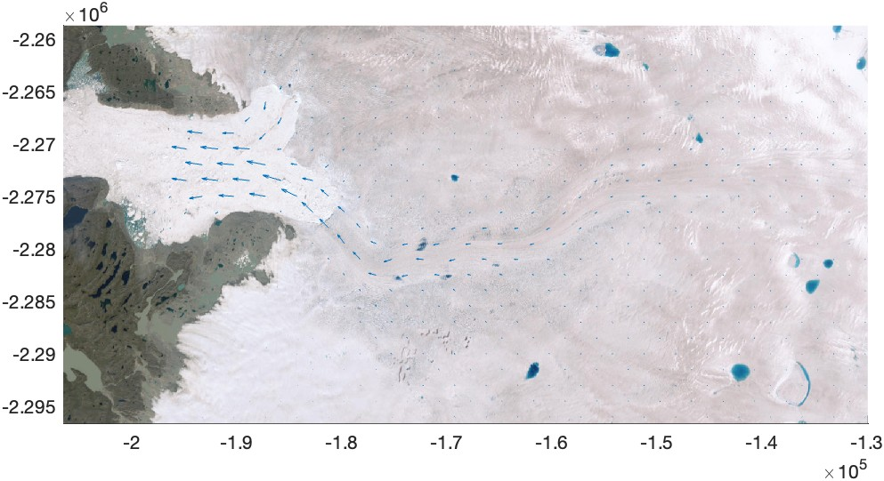

[&larr; Back to ITS\_LIVE main page](../README.md)

# `itslive_quiver` documentation
The `itslive_quiver` plots ITS_LIVE velocity data as quiver arrows.

*Tip: Zoom to desired map extents BEFORE calling `itslive_quiver`.*

## Syntax

```matlab
itslive_quiver(region)
itslive_quiver(region,'colorspec')
itslive_quiver(...Name,Value) 
itslive_quiver(...,'density','DensityFactor') 
h = itslive_quiver(...) 
```

## Description 

`itslive_quiver(region)` plots a quiver plot on the current map. The region is a number between 1 and 19. For a map of regions, type [`itslive_regions`](itslive_regions_documentation.md).

`itslive_quiver('colorspec')` specifies a color of the vectors, like `'r'` for red. 

`itslive_quiver(...Name,Value)` formats the quiver arrows with any quiver properties. 

`itslive_quiver(...,'density','DensityFactor')` specifies the density of the arrows. Default DensityFactor is `75`, meaning hypot(Nrows,Ncols)=75, but if your plot is too crowded you may specify a lower DensityFactor (and/or adjust the markersize). 

`h = itslive_quiver(...)` returns a handle `h` of the plotted quiver object.

## Example 1: Simple
Always set the axis limits of your area of interest _before_ calling `itslive_quiver`. Below, we zoom to the area surrounding Jakobshavn Glacier, Greenland, then call `itslive_quiver` and specify Region 5 for Greenland. I'm also plotting an optional basemap underneath for context, which you can get from my [`plot_basemap`](https://github.com/chadagreene/plot_basemap) repository.

```matlab
figure
axis([-206557    -129930   -2296636   -2258698])
itslive_quiver(5) 
plot_basemap('epsg',3413) % optional 

exportgraphics(gcf,'itslive_quiver_documentation_jakobshavn_simple.jpg')
```


## Example 2: Formatted arrows
Repeat the example above, but this time make the arrows red and thick: 

```matlab
figure
axis([-206557    -129930   -2296636   -2258698])
itslive_quiver(5, 'r', 'linewidth',2) 
plot_basemap('epsg',3413) % optional 

exportgraphics(gcf,'itslive_quiver_documentation_jakobshavn_formatted.jpg')
```


## Example 3: Arrow density 
Increase the density of arrows by specifying a number greater than the default 75: 

```matlab
figure
axis([-206557    -129930   -2296636   -2258698])
q = itslive_quiver(5, 'density', 150); 
plot_basemap('epsg',3413) % optional 

exportgraphics(gcf,'itslive_quiver_documentation_jakobshavn_dense.jpg')
```


Above, we returned a handle `q` for the quiver object. You can adjust the color, length, or other properties by setting values in `q`: 

```matlab
q.Color = [0 0 0];     % make arrows black
q.AutoScaleFactor = 5; % make arrows long

exportgraphics(gcf,'itslive_quiver_documentation_jakobshavn_dense_long.jpg')
```


# Author & Citation Info
The MATLAB functions in this repo and this documentation were written by Chad A. Greene of NASA/JPL. [The NASA MEaSUREs ITS\_LIVE project](https://its-live.jpl.nasa.gov/) is by Alex S. Gardner and the ITS\_LIVE team. If you use ITS\_LIVE v2 velocity data, please cite: 

Gardner, A. S., Greene, C. A., Kennedy, J. H., Fahnestock, M. A., Liukis, M., López, L. A., Lei, Y., Scambos, T. A., and Dehecq, A.: ITS_LIVE global glacier velocity data in near real time, EGUsphere [preprint], [https://doi.org/10.5194/egusphere-2025-392](https://doi.org/10.5194/egusphere-2025-392), 2025. 

