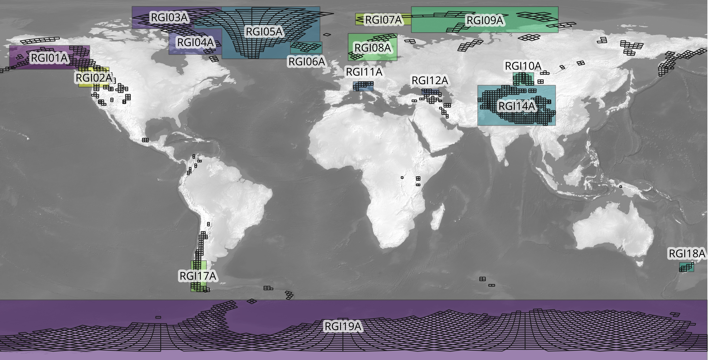

[&larr; Back to ITS\_LIVE main page](../README.md)

# `itslive_regions` documentation
The `itslive_regions` function displays a world map with ITS\_LIVE mosaic regions labeled. 

## Syntax

```matlab
itslive_regions
h = itslive_regions 
```

## Description 

`itslive_regions` displays a map of ITS\_LIVE regions. 

`h = itslive_regions` also returns a handle `h` of the plotted object. 

## Example
Here's how to show the ITS\_LIVE regions in MATLAB: 

```matlab
itslive_regions
```


To explore what data are available, check out [https://its-live-data.s3.amazonaws.com/index.html](https://its-live-data.s3.amazonaws.com/index.html).   

# Author Info
The MATLAB functions in this repo and this documentation were written by Chad A. Greene of NASA/JPL. [The NASA MEaSUREs ITS\_LIVE project](https://its-live.jpl.nasa.gov/) is by Alex S. Gardner and the ITS\_LIVE team. 

