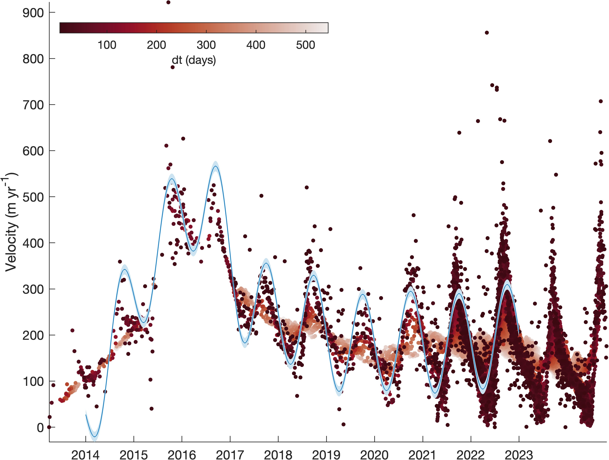

[&larr; Back to ITS\_LIVE main page](../README.md)

# `itslive_timeseries` documentation
The `itslive_timeseries` function builds a velocity time series including interannual and seasonal variability for a single location. 

## Syntax

```matlab
v = itslive_timeseries(region,lati,loni,ti)
v = itslive_timeseries(region,xi,yi,ti)
[v,v_error] = itslive_timeseries(...) 
```

## Description 

`v = itslive_timeseries(region,lati,loni,ti)` creates a velocity timeseries `v` for the location `lati,loni` at times `ti` in `datenum` or `datetime` format.[^1]

`v = itslive_timeseries(region,xi,yi,ti)` as above, but for coordinates `xi,yi` in meters corresponding to the projection of the ITS_LIVE region.

`[v,v_error] = itslive_timeseries(...)` also estimates error as the root sum square of `v_error` from the annual mosaics and `v_amp_error` from the summary mosaic. 

## Example 
Consider this location: [https://mappin.itsliveiceflow.science/?lat=34.3963&lon=85.9067&z=12&int=1&int=72&x=2012-07-15&x=2025-07-09&y=-70&y=992](https://mappin.itsliveiceflow.science/?lat=34.3963&lon=85.9067&z=12&int=1&int=72&x=2012-07-15&x=2025-07-09&y=-70&y=992)

From the ITS\_LIVE widget link above, you can download a csv with the latest data for the location in High Mountain Asia (region 14) at (34.3963°N,85.9067°E). Now let's say we want to plot the annual mosaic time series from 2104 to 2022. (Although Level 2 image-pair data are currently available through 2024, the annual mosaics are currently only available through 2022.) 

```matlab
region = 14; 
lat = 34.3963; 
lon = 85.9067; 
t = datenum('jan 1, 2014'):datenum('dec 31, 2022'); 

[v,v_error] = itslive_timeseries(region,lat,lon,t); 

figure
boundedline(t,v,v_error) % from Climate Data Toolbox
datetick('x')

% Add Level 2 data for context: 
T = readtable('lat_34.3963_lon_85.9067 2.csv','TextType','string'); 

% Convert time string to datenum: 
for k = 1:height(T)
    T.t(k) = datenum(T.mid_date{k}(1:10)); 
end
% 
hold on
h = scatter3(T.t,T.v_m_yr_,-T.dt_days_,10,T.dt_days_,'filled'); 
cmocean -amp % optional colormap 
axis tight
ylabel 'Velocity (m yr^{-1})'
cb = colorbar('north'); 
cb.Position(3:4) = cb.Position(3:4)/2; 
xlabel(cb,'dt (days)')
```



Note: Above, we've plotted velocity values on a color scale representing the time between image pairs dt, and we've used `scatter3` to stack the markers in a way that shorter dt values appear at the top of the graphical stack (by plotting negative dt values). The rationale here is because one-year dt values cannot, by definition, contain any type of seasonal variability. That's why the longer dt values increase and decrease smoothly, without the seasonal spikes and troughs. Very short dt values, however, may be associated with greater error, because a given displacement error over a shorter dt create a larger velocity error. Finding the perfect thresholds for which dt image pairs to include and which exclude may require some manual tuning for your specific application. 

# Author Info
The MATLAB functions in this repo and this documentation were written by Chad A. Greene of NASA/JPL. [The NASA MEaSUREs ITS\_LIVE project](https://its-live.jpl.nasa.gov/) is by Alex S. Gardner and the ITS\_LIVE team. 
[^1]: (Requires MATLAB's Mapping Toolbox)
